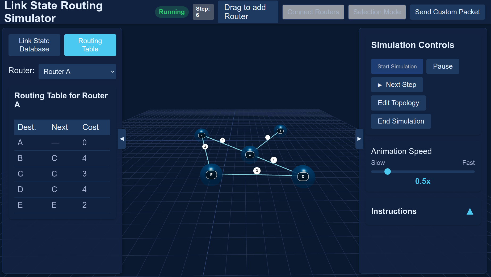

# Link State Routing Simulator

🚀 A visual, interactive simulator demonstrating how **link state routing protocols** operate in computer networks using **React** and **JavaScript**.



## 📌 Features

- 🖱️ **Drag-and-drop** routers onto the simulation area  
- 🔗 Connect routers and define **custom link costs**  
- 🛰️ Run animated **Link State Packet (LSP)** flooding across the network  
- 🧠 Each router builds its own **Link State Database (LSDB)**  
- 🧮 Routers compute shortest paths using **Dijkstra's Algorithm**  
- 🔁 **Redundant LSP detection**: LSPs that bring **no new information** still reach routers but **blink red** to indicate redundancy (green for useful updates)  
- 📨 **Send Custom Packets**: Use the **Ping Packet** feature to test connectivity between any two routers  
- 🧑‍🏫 **Built-in Tutorial**: Click the **Help** button in the UI for a guided walkthrough of how to use the simulator  
- ⏱️ Control simulation speed and pause/resume as needed  
- 📋 Inspect **LSDBs and Routing Tables** for any selected router  

## 🧠 Concepts Illustrated

- Neighbor discovery via hello packets  
- Link State Packet flooding  
- Redundant vs. useful link state updates  
- Topology database construction  
- Dijkstra's shortest path routing  
- Custom packet testing and path visualization  

## 🛠️ Technologies Used

- **React** – for UI and interactivity  
- **GSAP** – for smooth animations and LSP blinking effects  
- **JavaScript** – for network simulation logic and Dijkstra’s algorithm  

## 🧪 How to Use

1. **Add Routers**: Drag from the left panel to the stage  
2. **Connect Routers**: Use "Connect Routers" and select two routers  
3. **Run Simulation**: Click "Start Simulation" to begin  
4. **Send Ping Packets**: Use "Send Custom Packet" to test connectivity  
5. **Use Help**: Click the **Help** button for a built-in tutorial  
6. **View Data**: See updated LSDBs and shortest paths  
7. **Control**: Adjust speed or pause/resume the simulation  

## ⚙️ Installation

```bash
npm install --legacy-peer-deps
npm start
```

## 🔗 Links

- 🌐 **Live Demo**: [https://hemanth4646k.github.io/Link-State-Routing-Simulator/](https://hemanth4646k.github.io/Link-State-Routing-Simulator/)
